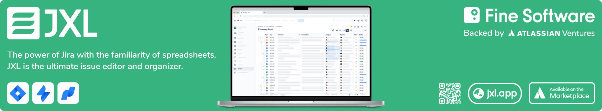

[](https://jxl.app)

<br>

<h1 align="center">Hello Charlie 👋</h1>

<p align="center">A <a href="https://jamstack.org">Jamstack</a>-based sample app for Jira Cloud, based on <a href="https://next.js">next.js</a> ⚛️</p>
<p align="center">Compatible with <a href="https://developer.atlassian.com/cloud/jira/platform/getting-started-with-connect/">Atlassian Connect</a> and <a href="https://developer.atlassian.com/cloud/jira/platform/getting-started-with-forge/">Atlassian Forge</a></p>

## Background

Jamstack apps achieve performance, scalability, and developer productivity through static frontends that come straight from the CDN and interact with distributed backends through Javascript.

The Atlassian ecosystem, which runs app experiences in `iframes` within the host product (e.g., Jira or Confluence), lends itself well to such architecture: Not only do Jira or Confluence apps benefit from all features of the Jamstack, it also makes it very easy to migrate between [Atlassian Connect](https://developer.atlassian.com/cloud/jira/platform/getting-started-with-connect/) and the new [Atlassian Forge](https://developer.atlassian.com/cloud/jira/platform/getting-started-with-forge/) platform.

Jamstack-based Connect apps fetch their resources from a CDN, and then invoke their own backends, as well as the host product's APIs, via Ajax. Forge apps are fundamentally different from Connect apps, in that Forge apps are deployed _into_ Atlassian infrastructure - meaning that app developers no longer need to provide their own CDN or SaaS infrastructure. For Jamstack-based apps, however, this is only a minor implementation detail - apps are _still_ fetched from a CDN, and apps _still_ invoke their backends via Ajax calls. If the platform-specific integration points are abstracted away behind common APIs, an app's business logic can remain largely unaffected by the underlying extension framework.

In this sample app, the same piece of business logic is consumed into two simple next.js apps; one for Connect, and one for Forge. These next.js apps are only lightweight "shells" around the business logic; their main responsibility, beyond providing next.js' Jamstack infrastructure, is

1. to perform Connect- or Forge-specific set up steps, e.g. in the page `header`.
1. in their `webpack` config, to "inject" Connect- or Forge-specific implementations of two abstractions around the platforms' extension points; one to invoke Jira's REST API, and one to navigate within Jira.


## Repository structure

The repo is organised as a `yarn workspaces`-powered monorepo:

##### `libraries/jira-request(-api/-forge/-connect)`

The stub implementation (`jira-request`), API (`*-api`), and Connect and Forge implementations (`*-connect`, `*-forge`) of the app's abstraction around [Jira's REST API](https://developer.atlassian.com/cloud/jira/platform/rest/v3/intro/). Exposes a single `request` method that takes the URL of the REST endpoint and an optional `Options` object:

```js
import { request } from '@hello-charlie/jira-request';

const projects = await request('/rest/api/3/project');

const issue = await request('/rest/api/3/issue', {
  type: 'POST',
  data: { fields: { project: { id: '42' }, summary: 'New issue', issuetype: { id: '42' } } },
});
```

##### `libraries/react-link(-api/-forge/-connect)`

The stub implementation (`react-link`), API (`*-api`), and Connect and Forge implementations (`*-connect`, `*-forge`) of the app's abstraction around anchor tags. Exposes a single `Link` component that takes a `href` as well as an optional `style` prop:

```js
import { Link } from '@hello-charlie/react-link';

export const View = () => (
  <p>
    Here's an <Link href="https://jxl.app">external link</Link>,{' '}
    and here's an <Link href="/browse/JXL">internal link</Link>
  </p>
);
```

##### `routes/hello`

The `/hello` route of our next.js sites. Contains your app's main business logic. Uses `@hello-charlie/jira-request` and `@hello-charlie/react-link` to fetch data from, and navigate within, Jira.

##### `services/connect/site`

The next.js site of our Connect app. Imports `@hello-charlie/route-hello` as its `/hello` route. In its webpack configuration (`next.config.js`), replaces the stub implementations of `jira-request` and `react-link` by their Connect implementations. Provides the app's [app descriptor](https://developer.atlassian.com/cloud/jira/platform/connect-app-descriptor/) (`atlassian-connect.json`) through its `public` folder.

##### `services/forge/site-hello`

The next.js site of our Forge app's `hello` resource. Imports `@hello-charlie/route-hello` as its `/index` route. In its webpack configuration (`next.config.js`), replaces the stub implementations of `jira-request` and `react-link` by their Forge implementations. As part of the build process, is exported into the Forge _app_ (see below).

##### `services/forge/app`

The Forge app. Provides the app's `manifest.yml`, `index.js`, etc. in the expected file and folder structure. As part of the build process, receives its `hello` resource from the Hello site (see above).


## Setup

### Basics

- Install [nvm](https://github.com/nvm-sh/nvm), [yarn](https://yarnpkg.com/lang/en/), [Typescript](https://www.typescriptlang.org/), and [ngrok](https://ngrok.com/).
- In your repo folder, run `nvm use`. This enables Node 12, as is currently required by Forge.
- In your repo folder, run `yarn`. This installs all required dependencies.

### Running Hello Charlie as a Connect app

- In your repo folder, run `yarn run hello-charlie:connect-site:dev`. This starts the next.js site of our Connect app, at `localhost:3000`.
- Expose `localhost:3000` to the internet via `ngrok`, e.g. via `ngrok http 3000`.
- In your [`atlassian-connect.json`](packages/hello-charlie/services/connect/site/public/atlassian-connect.json), replace `<your-base-url>` with your tunnel's URL (e.g. `https://abcd1234.ngrok.io`).
- Install your app as described [here](https://developer.atlassian.com/cloud/jira/platform/getting-started-with-connect/#set-up-your-development-environment).
- In your Jira site, navigate to a project. Find "Hello Charlie" in the sidebar. 🚀

### Running Hello Charlie as a Forge app

- Outside (!) of your repo folder, create a new Forge app for Jira, using the Forge CLI. Copy your app's `app ID` into the [`manifest.yml`](packages/hello-charlie/services/forge/app/manifest.yml) of this repo. You can then delete all files of your newly created app; we'll use the app code of this repo instead.
- In your repo folder, run `hello-charlie:forge-site-hello:export`. This exports the next.js site of your Forge app into the `app` directory.
- Navigate to your repo's `app` folder: `cd packages/hello-charlie/services/forge/app`.
- In the `app` folder, use the Forge CLI to deploy and install the Forge app as described [here](https://developer.atlassian.com/platform/forge/getting-started/).
- In your Jira site, navigate to a project. Find "Hello Charlie" in the sidebar. 🚀

<br>

[](https://jxl.app)

